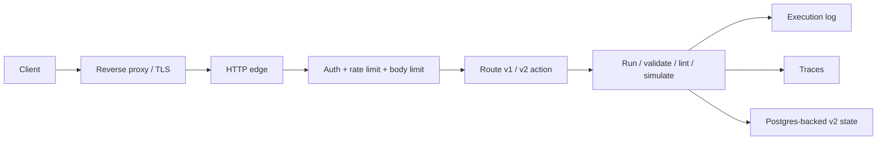

# v3

## What It Is

The live HTTP edge. It exposes versioned workflow operations and wraps the engine with operational controls.

## Constraints

- Public traffic goes through the reverse proxy front door.
- API key auth is required for public use.
- Concurrency limits and request limits are enforced.
- Traces and execution logs are emitted for each request.
- `v1` HTTP is disabled by default; `v2` is the public production path.

## Operational Reality

- `v3` is the user-facing layer.
- It should stay thin.
- It should not own business logic beyond routing, policy, and enforcement.
- Its main job is to make the engine safe to expose publicly.

## Tests

- [`src/tests/v3/index.test.ts`](/Users/settoramediku/Documents/Github/kofi-ska/swe-projects/workflow-engine/src/tests/v3/index.test.ts)
- Covers versioned validation, simulation, runtime commit, trace export, and API-key authorization behavior.
